# Sisacco App

A Flutter-based mobile application for financial management and banking services.

## Features

- **User Authentication**: Secure login and registration system
- **Account Management**: View and manage multiple bank accounts
- **Transaction History**: Track all financial transactions
- **Loan Management**: Apply for and manage loans
- **Money Transfers**: Send money between accounts
- **Admin Dashboard**: Administrative tools for managing users and transactions
- **Real-time Updates**: Live updates for account balances and transactions

## Tech Stack

- **Frontend**: Flutter (Dart)
- **Backend**: Supabase (PostgreSQL + Real-time subscriptions)
- **Authentication**: Supabase Auth
- **State Management**: Provider pattern
- **UI Components**: Custom Flutter widgets with Material Design

## Getting Started

### Prerequisites

- Flutter SDK (3.24.1 or higher)
- Dart SDK (3.5.1 or higher)
- Android Studio / VS Code
- Android SDK (API level 34)
- Git

### Installation

1. **Clone the repository**
   ```bash
   git clone https://github.com/bravonokoth/sisacco.git
   cd sisacco
   ```

2. **Install dependencies**
   ```bash
   flutter pub get
   ```

3. **Configure Supabase**
   - Create a Supabase project at [supabase.com](https://supabase.com)
   - Update the Supabase configuration in `lib/config/supabase_config.dart`
   - Set up your database tables and authentication

4. **Run the application**
   ```bash
   flutter run
   ```

## Project Structure

```
lib/
├── config/           # Configuration files
├── models/           # Data models
├── providers/        # State management
├── screens/          # UI screens
│   ├── admin/        # Admin-specific screens
│   ├── auth/         # Authentication screens
│   └── user/         # User screens
├── services/         # API services
├── theme/            # App theming
├── utils/            # Utility functions
└── widgets/          # Reusable widgets
```

## Key Dependencies

- `supabase_flutter`: Backend and authentication
- `provider`: State management
- `google_maps_flutter`: Location services
- `image_picker`: Image selection
- `mobile_scanner`: QR code scanning
- `firebase_messaging`: Push notifications
- `local_auth`: Biometric authentication

## Contributing

1. Fork the repository
2. Create a feature branch (`git checkout -b feature/amazing-feature`)
3. Commit your changes (`git commit -m 'Add some amazing feature'`)
4. Push to the branch (`git push origin feature/amazing-feature`)
5. Open a Pull Request

## License

This project is licensed under the MIT License - see the [LICENSE](LICENSE) file for details.

## Support

For support, email bravonorwa@gmail.com or create an issue in this repository.

## Screenshots


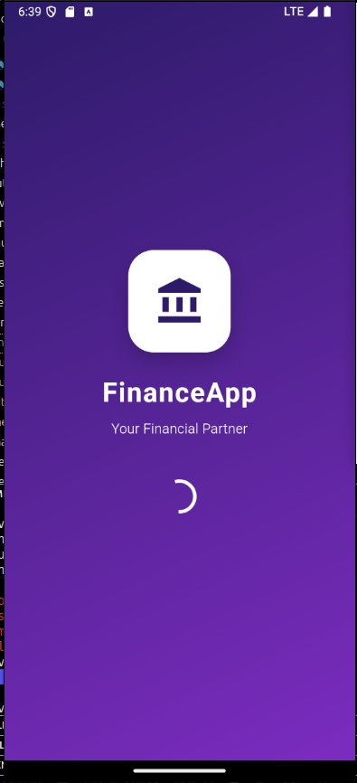


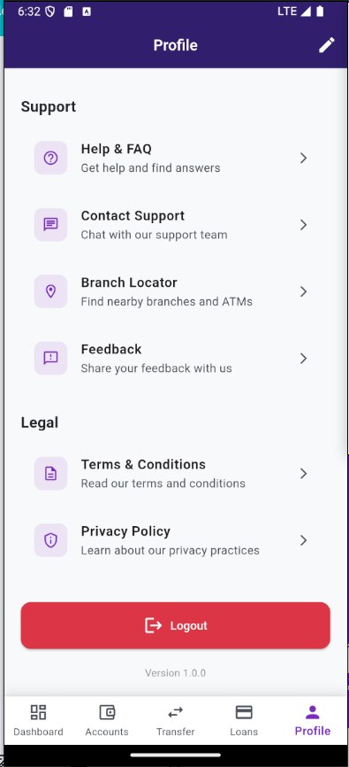


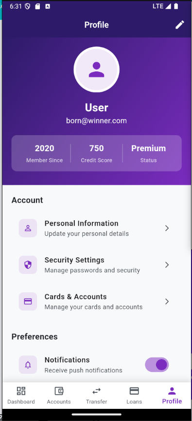


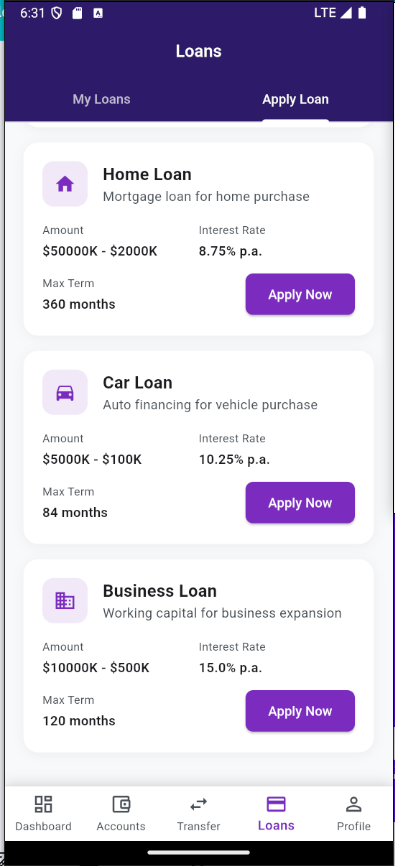


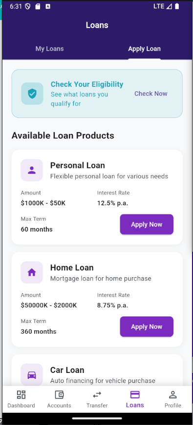


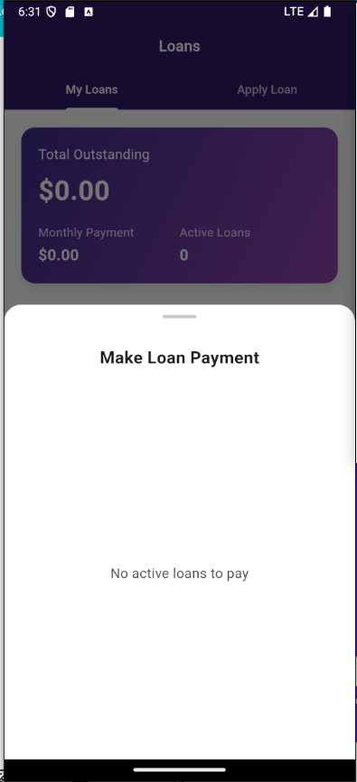


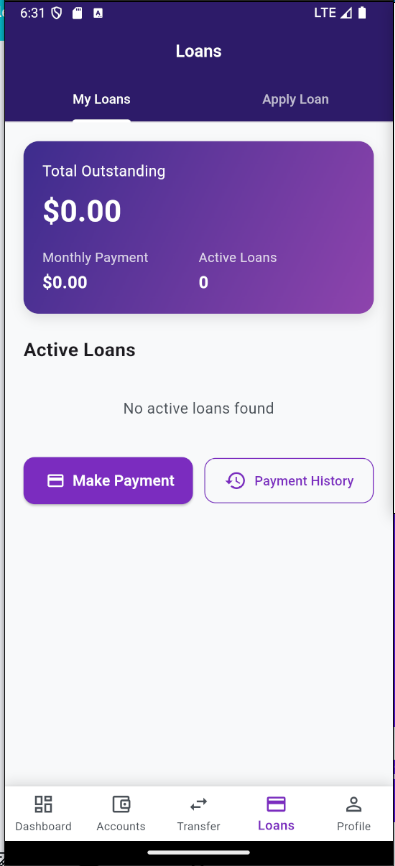


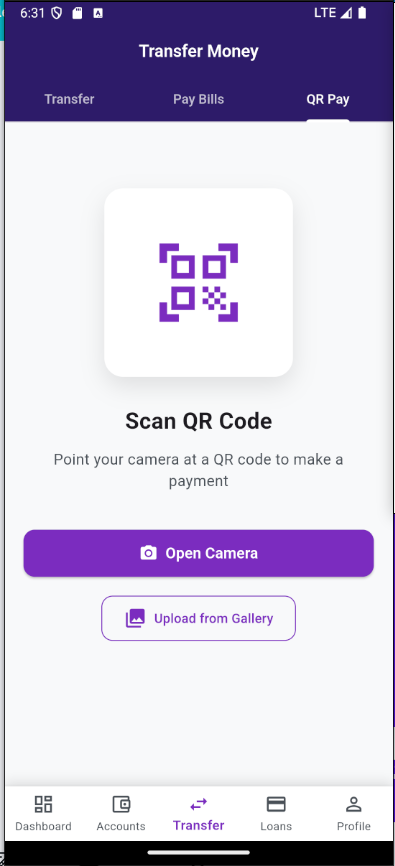


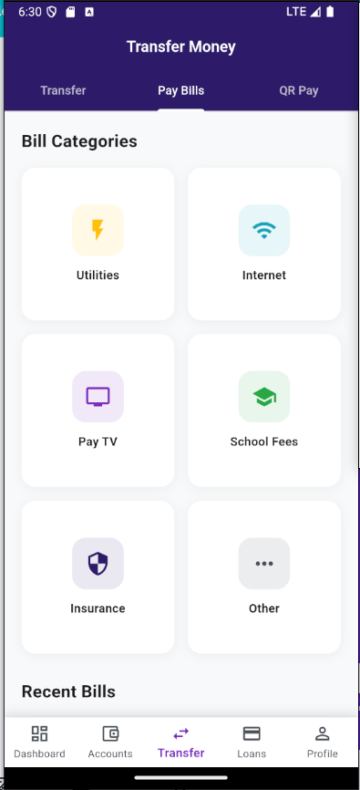


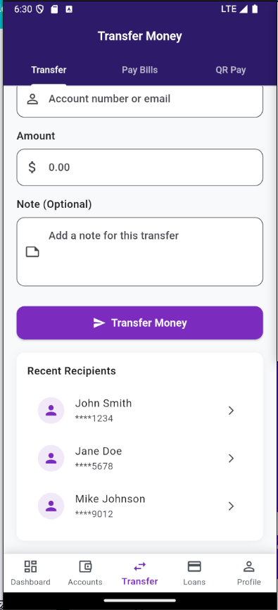


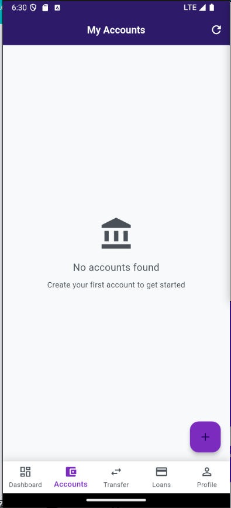


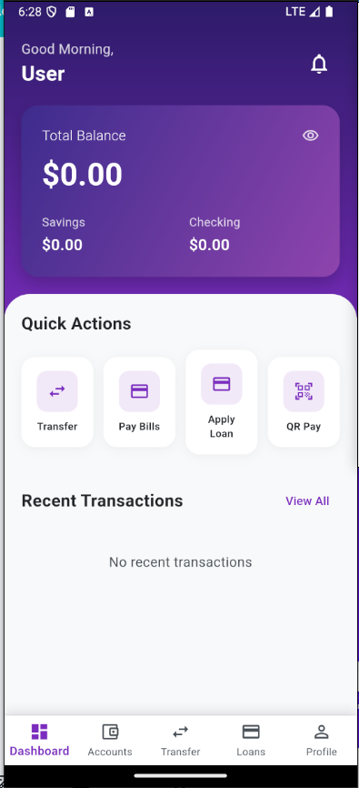

Note: This is a development version. Some features may be in progress or subject to change.

---

**Note**: This is a development version. Some features may be in progress or subject to change.
